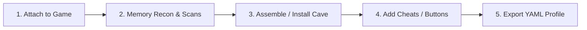

# Trainlab External Agent Guide

This guide is for AI coding agents and external clients developing cheat profiles or driving memory discovery against a running `trainlab` instance over the Model Context Protocol (MCP).

---

## 1. Connecting to the MCP Server

Trainlab hosts a Streamable-HTTP MCP server on port **8123** (default endpoint: `http://<device-ip>:8123/mcp`).

### Goose / MCP Configuration Example
```yaml
extensions:
  trainlab:
    type: streamable_http
    uri: http://<device-ip>:8123/mcp
```

---

## 2. Core MCP Workflow for Cheat Creation



### Step 1: Process Attachment
- `find_games`: List candidate game processes.
- `attach_game(game: "helldivers.exe")`: Injects `trainlab_inject.dll` into the game process and initiates the IPC channel.

### Step 2: Memory Hunting & Pointer Tracing
- `aob_scan(pattern: "48 8B 05 ?? ?? ?? ??")`: Scan executable code/data for signatures.
- `pointer_chase(base: "helldivers.exe+0x1b42e9", offsets: ["0x10", "0x28"])`: Resolve multi-level pointer chains.
- `read(address: "0x140001000", len: 16)` / `read_value(...)`: Inspect memory.
- `dump_struct(address: "$player_base", fields: [...])`: Read structured object attributes.

### Step 3: Allocation & Code Caves
- `allocate_memory(size: 16384, permissions: "rw", marker: "my_buf")`: Allocate raw buffers.
- `allocate_string(content: "...", kind: "c", marker: "prog_code")`: Allocate strings/scripts in game memory.
- `install_cave(target_ref: "hook_site", hook: "override", jump: "relative", asm: "...")`: Install pure x86-64 assembly caves. Data slot labels defined in the assembly automatically become session markers.

### Step 4: Adding Cheats to Session
- `add_cheat(...)`: Register value, toggle, or command buttons into the live session.
- Once added, cheats immediately appear in the **In-Game Overlay** and GUI.

### Step 5: Exporting & Validating Cheat Profiles
- `save_profile(filename: "cheats/my_game.yaml")`: Export session cheats into a restart-stable YAML profile.
- `validate_profile(profile: "my_game.yaml")`: Verify that all AOB patterns, offsets, and address references are sound.
- `list_profiles`: List all discovered profiles (including parse validation errors if any file has syntax issues).

---

## 3. Creating Issues & Bug Reports

When encountering edge-case game crashes, unhandled x86 opcodes, or GUI/protocol bugs, drop an issue report into `inbox/` using [`docs/ISSUE_TEMPLATE.md`](ISSUE_TEMPLATE.md).
